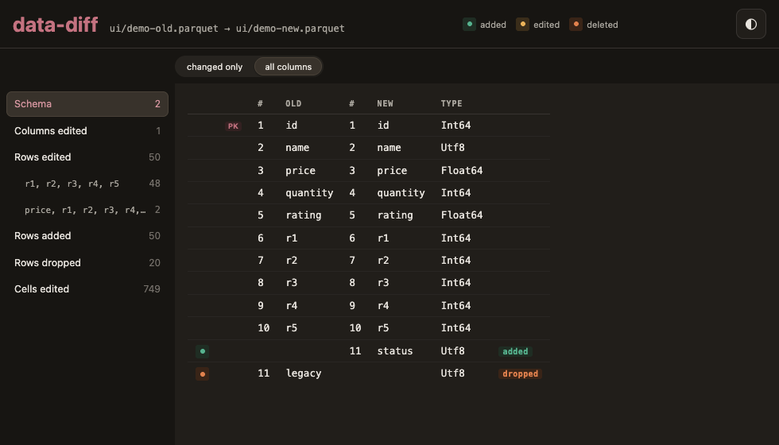

# data-diff

`data-diff` is tool that compares two Parquet files and emits a semantic diff as a compact, operation-oriented summary. It has two output modes: 

* An browser UI designed for interactive usage
* A text summary designed for batch job and logging

I'll focus on the text summary in this README because it makes it easier to understand what `data-diff` does, but I expect most real usage will add `--ui`.

## Basic usage

You give `data-diff` the paths two parquet files and it succinctly summarises the differences:

```console
data-diff old.parquet new.parquet
> table_key([id], basis: guessed, overlap: 1.00)
> col_drop(product)
> col_add(stock)
> col_edit(price, changes: 4)
```

Here we dropped the `product` column, added the `stock` column, and editted the `price` column.

The first line tells us the key (i.e. the set of columns that uniquely identifies each row), which use `data-dict` uses to match rows across the two tables. `data-diff` will guess it if you don't supply it, but it's faster and safer to supply it if you know:

```console
data-diff old.parquet new.parquet --key customer_id,date
> table_key([customer_id, date], basis: declared)
> row_drop(rows: 1)
> row_add(rows: 1)
> row_edit(rows: 1, changes: 3, columns: [quantity, price, note])
```

If the key has been renamed use `--key old/new`, and if there is no key, fallback to using the row number as the identifier with `--key :row`. If you suggest a combination of columns that doesn't actually form a primary key, `data-dict` will let you know.

Add the `--ui` flag to get an interactive UI. You can click on each summary in the sidebar to see the details. The server prints its address (default http://127.0.0.1:9471, `--port` to change) and opens it in your browser.

```console
data-diff old.parquet new.parquet --key id --ui
```
<!-- To recreate ui/screenshot.png: build the frontend, generate the demo pair, serve it, then capture with headless Chrome. Use --window-size=980,560 to frame the view content -->



See more examples in [demo/README.md](demo/README.md).

## Installation

Pre-built binaries are coming soon. For now, you'll need to clone the repo then:

```console
git clone https://github.com/hadley/data-diff
cd data-diff/
cargo build
```

You can run directly from the checkout:

```console
cargo run -- old.parquet new.parquet --key customer_id,date,region
```

Or install then run:

```console
cargo install --path .
data-diff old.parquet new.parquet --key customer_id,date,region
```

## Semantics

`data-diff` attempts to turn every change into one of the following row and column operation:

| Operation | Meaning |
|---|---|
| `col_add(new)`, `col_drop(old)` | a column that only exists on one side |
| `col_rename(old -> new, basis: how)` | one column, named differently in each file, and how that was established |
| `col_edit(new, ...)` | a column whose type or values changed, and how many cells |
| `col_order(new, old_idx -> new_idx)` | the fewest columns that must move to explain the new order |
| `row_add(rows: n)`, `row_drop(rows: n)` | rows that only exist on one side |
| `row_edit(rows: n, changes: m, columns: [...])` | rows sharing one changed-column set: how many rows, how many cells, and which columns when the list is short |
| `row_fanout(old_idx -> [new_idx, ...])` | one old row that several new rows share a key with |
| `row_order(old_idx -> new_idx)` | the fewest rows that must move to explain the new order |

This is most challenging for cell edits: how do you figure out if a bunch of changes scatter across a table represent row or column changes? `data-dict` frames this as a problem of parsimony: it picks the smallest description that summarises the changes. And then because that might be wrong, it exposes other options in the UI.

## Hints

Some changes cannot be worked out from the data: for example, a column renamed and rewritten at the same time, or columns and rows modified together. In this case you can provide a **hint** to say what happened, e.g.:

```console
data-diff old.parquet new.parquet --key id --hint 'col_rename(discount -> markdown)'
> table_key([id], basis: declared)
> col_rename(discount -> markdown, basis: hinted)
> col_edit(markdown, changes: 3)
```

You can repeat `--hint`, or use `--hints hints.txt` to read a file of hints. Blank lines and `#` comments are skipped.

There are currently four hints:

| Hint | Says |
|---|---|
| `col_rename(old -> new)` | these two columns are one column |
| `col_drop(old)`, `col_add(new)` | this column has no counterpart. Use to choose replacement over a rename |
| `col_edit(column)`, `col_edit(old -> new)` | this column changed, rather than being half of a swap or a row's worth of edits |
