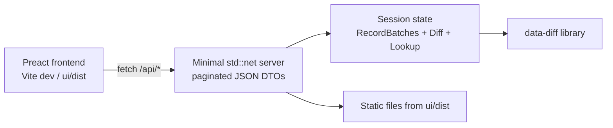

# Todo

- [x] **Scaffold the app.** `ui/` with Vite + Preact + TypeScript on the frontend and `ui/server` as a workspace member depending on the `data-diff` library by path. Plain CSS, no framework. (Opened as Tauri, then re-scoped 2026-08-10: serve straight to the browser instead — the desktop shell was buying nothing a local server doesn't.)
- [x] **Hold the session in the server.** A `Session` owns the two `RecordBatch`es, the `Diff`, and the options that produced it; shared state behind a `Mutex`. `POST /api/open` runs the diff and builds the session; `POST /api/hints` re-runs and replaces it.
- [x] **Serve HTTP without new dependencies.** A minimal HTTP/1.1 server over `std::net` (`ui/server/src/http.rs`): JSON routes under `/api/*`, static files from `ui/dist`, one thread per connection — far past need for a local single-user tool, and the sandboxed/offline build stays intact.
- [x] **Define the DTOs and routes.** Serde mirrors of the model types in the server crate (the library stays serde-free), every list paginated as `{ items, total, page, page_size }`: `GET /api/session`, `POST /api/open`, `POST /api/hints`, `GET /api/schema`, `GET /api/cells`, `GET /api/column-view`, `GET /api/row-view`.
- [x] **Build the schema panel.** Two-sided aligned schema: key marks, old position always shown and new position only when moved, rename basis badges, inline type changes, changed-only default with the all-columns toggle. Hint actions: split a rename into drop + add, join an add/drop pair into a rename, assert `col_edit()` — all through `POST /api/hints`.
- [x] **Build the three value views.** Shared `PagedTable` (frozen key columns, grouped old/new headers, changed-cell highlighting, distinct null/NaN/empty rendering), `Expando`, `Pager`, `Toggle`. `ColumnView`: edited columns side by side, per-axis changed/all toggles, added/dropped join control. `RowView`: expandos for edited (stacked old/new rows), added, dropped, moved (positions only), fanout (aligned table from `FanoutEvent.cells`). `CellView`: `key | column | old | new` with column/row filters and key/column sorting, exactly `Diff::cells`.
- [x] **Pick the opening view from the summary.** Column-dominated cover opens the column view, row-dominated the row view, diffuse or `optimal == false` the cell view (`ui/src/opening.ts`); the user can always switch via the tabset.
- [x] **Wire launch and git integration.** Positional args `old new` with `--key`/`--hint`/`--hints` mirroring the CLI, plus `--port`; no args opens the path form (a browser cannot browse the server filesystem, so the Tauri plan's native pickers became text inputs). The server prints its URL and opens the browser. Git difftool config (`$LOCAL $REMOTE` maps to old/new) and the `.gitattributes` hook documented in `ui/README.md`.
- [x] **Cover it.** Rust: integration tests for every command against isolated fixtures, `insta` snapshots of the DTOs, repeated commands byte-identical. Frontend: vitest + @testing-library/preact for `Pager`/`Expando`/`ValueText` and the opening-view selection. No e2e in this step; the server was smoke-tested end to end against the demo fixtures (session, paginated cells, static shell).
- [x] **Complete the acceptance pass.** `cargo build --workspace --all-targets`, `cargo test --workspace --all-targets`, `cargo clippy --workspace --all-targets -- -D warnings`, `cargo fmt --all -- --check`, `git diff --check`, frontend `npm test` and `npm run build`, and a release build of the server.

# Goal

Implement ui-design.md as a browser app: schema panel with hints, three value views (column, row, cell) with automatic opening view, everything paginated and lazily loaded over HTTP from the in-process library, building on the reviewed `Lookup`/`Value` API. The app launches with two paths (`data-diff-ui old.parquet new.parquet`), takes paths from a form otherwise, and is documented for use as a git difftool.

# Scope

New `ui/` directory (frontend and `server`), workspace membership, `ui/README.md`, tests. The existing CLI binary and library surface are untouched. Deferred: keyboard navigation, search within tables, export, theming, e2e tests, one-sided `:missing` sessions in the UI.

# Architecture

DTOs are serde-serializable mirrors of the model types, defined in the server crate — the library's model types stay free of serde (owner deferred the choice, 2026-08-10; this keeps the library surface unchanged).

# Definition of done

The server runs against two Parquet files and the browser renders the schema panel and all three value views per ui-design.md, paginated and lazily loaded, with hints round-tripping through `POST /api/hints`; the opening view follows the summary rule; launch-with-paths and the git difftool config are documented; Rust and frontend tests pass with determinism checks; and the full acceptance pass above is clean.
