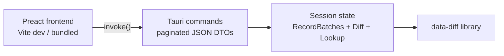

# Status

Drafted for owner review. Becomes `plan.md` when the lazy-lookup step lands and this item is taken from `plan-next.md`. Depends on the lookup API (`Value`, `Lookup`) from that step.

# Goal

Implement ui-design.md as a desktop app: schema panel with hints, three value views (column, row, cell) with automatic opening view, everything paginated and lazily loaded through Tauri commands into the in-process library. The app launches with two paths (`data-diff-ui old.parquet new.parquet`), offers file pickers when launched without, and is documented for use as a git difftool.

# Architecture

* New workspace member `ui/` (Tauri 2): `ui/src-tauri/` Rust crate depending on the `data-diff` library path, `ui/src/` Preact app. The existing CLI binary is untouched.
* A `Session` struct in `src-tauri` holds the two `RecordBatch`es, the `Diff`, and a `Lookup` — created once per file pair, kept in Tauri state behind a `Mutex`. Re-running with hints replaces the session.
* The library is synchronous; commands run on Tauri's async runtime with `spawn_blocking` for the initial diff.

# Tauri commands (the IPC surface)

All return JSON DTOs; all lists paginated as `{ items, total, page }`.

* `open_files(old, new, key, hints) -> SessionSummary` — run the diff, build the session, return the edit summary plus schema panel data (enough to pick the opening view and render the first screen without a second round trip).
* `schema_panel(changed_only: bool) -> Vec<SchemaRow>` — aligned identities/adds/drops with basis badges, type changes, key marks, positions.
* `apply_hints(hints) -> SessionSummary` — re-run the diff with the updated hint set (split rename, join add/drop, `col_edit`); replaces the session. This is the hint surface of the schema panel.
* `cells_page(filter: {column?, row?}, sort, page) -> Page<CellRow>` — the cell view: `key | column | old | new`, values via `Lookup`, key components widened.
* `column_view(toggles, page) -> ColumnViewData` — edited columns side by side, one value per column on the chosen side, changed/all toggles per axis, added/dropped columns join control.
* `row_view_section(kind, toggles, side, page) -> RowViewData` — one command per expando: edited (one line per row on the chosen side), added, dropped, moved (positions only), fanout (aligned table from `FanoutEvent.cells`).

DTOs are serde-serializable mirrors of the model types, defined in `src-tauri` — the library's model types stay free of serde unless the owner prefers deriving it there.

# Frontend components (Preact)

* `App` — session state, file pickers (Tauri dialog plugin), opening-view selection from the edit summary (column-dominated → column view; row-dominated → row view; diffuse or `optimal == false` → cell view).
* `SchemaPanel` — aligned schema on the toolbar's chosen side, key column, basis badges, type-change arrows, changed/all toggle, hint actions (split/join/`col_edit`) calling `apply_hints`.
* `ValueViews` — tabset over the three views.
* `ColumnView` / `RowView` / `CellView` — per ui-design.md sections, composed from shared primitives:
  * `Expando` — minimized kind + count, expanded paginated table.
  * `PagedTable` — frozen key columns (sticky left), old/new grouped headers, changed-cell highlighting, distinct null/NaN/empty rendering.
  * `Pager`, `Toggle` — shared controls.
* Styling: plain CSS, no framework.

# CLI / git integration

* Positional args `old new` with `--key`/`--hint`/`--hints` mirroring the CLI; no args → file pickers.
* Git: document a difftool entry (`git config diff.tool data-diff-ui`, `difftool.data-diff-ui.cmd`) and a `.gitattributes` hook for `*.parquet`. Verify the arg order git passes (`$LOCAL $REMOTE`) maps to old/new.

# Testing

* Rust side: integration tests for every command against isolated fixtures (session build, each paginated query, hint re-run replacing state), snapshot DTOs with `insta`, determinism check (repeated commands byte-identical).
* Frontend: component tests for `PagedTable`/`Expando`/`Pager` and view-selection logic (vitest + preact-testing-library); no e2e in this step.
* Acceptance: full workspace build/test/clippy/fmt/diff-check, plus `cargo tauri build` compiling.

# Deferred

Keyboard navigation, search within tables, export, theming, e2e tests, packaging/signing, one-sided `:missing` sessions in the UI.
